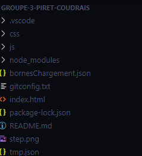
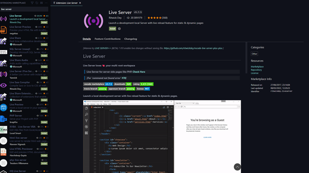
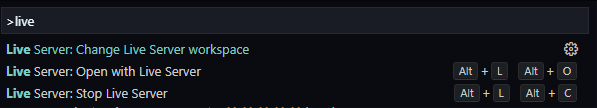

# Guide d'installation (pour que nous puissions installer et tester votre projet).
Notre projet a été développé en vanilla (pas de framework). Cela ne nécessite donc pas l’installation
d’outil particulier si ce n’est un serveur local.
Pour la procédure, nous allons utiliser VS Code ainsi que l’extension Live Server.
Dans un premier temps, ouvrez le dossier parent du projet dans VS Code :  
  
Dans l’onglet Extension, recherchez et installez Live Server :
 
  
Utiliser ensuite la commande Ctrl+Shift+P, pour ouvrir la barre de recherche des commandes. Taper
« live server » et sélectionner « Open with Live Server ».
 
  
Votre navigateur par défaut se lance normalement avec le projet ouvert.

# Liste des changements suite à la dernière séance # (aujourd'hui 28/03)
* Ajout d'information dans les pop-up
* AJout du calcul de temps de recharge pendant les passages aux bornes de recharge 
# Liste des frameworks utilisés
* Aucun 
# Liste des bibliothèques utilisées (y compris plugins Leaflet)
## Leaflet
  * Gérer les marker
  * Afficher la carte
  * Gérer les cluster de marker
  * Gérer la ligne de l'itinéraire 
## Bootstrap
  * Gérer l'agencement de page (navbar par exemple)
  * Gérer le design de certains éléments
## Turf
  * Pour avoir la distance d'un point à un autre
  * Pour avoir le point le plus proche d'un point donné à partir d'une collection de point

# Liste des API utilisées (liste des fournisseurs, liste des points d'entrées)
 ## Openchargemap
  * Pour avoir les liste des bornes de selon plusieurs critères. 
  * Nous avons choisi de prendre toutes les bornes de rechargement en france et mettre la réponse de cette API dans un fichier .json pour ne pas avoir à requêter tout le temps étant donné que c'est une requête assez lourde.
  ## MapBox
  * Nous permet de calculer un itinéraire selon 2 coordonné ou plus si on veut des étapes
  * Nous renvoie beaucoup de données dont on a besoin dont les étapes d'un itinéraire, assez de coordonnés de l'itinéraire pour qu'on puisse tracer une ligne représentant l'itiniéraire
  * Nous permet également d'avoir le géocoding. C'est à dire de convertir des adresse postale en coordonné pour placer nos marker
  * On s'en sert aussi pour avoir des prédiction d'adresse postale quand on commence a en taper pour en avoir des vraiment exacte.
## Openstreetmap
  * L'affichage de la map est fait par leaflet mais il va requeter l'API d'Openstreetmap pour avoir les données dont il a besoin 
# Webographie des tutos et documentations notables utilisées
* Nous avons globalement utilisé les documentations et tutoriels de toutes les API et librairies que nous utilisons dans notre projet.
